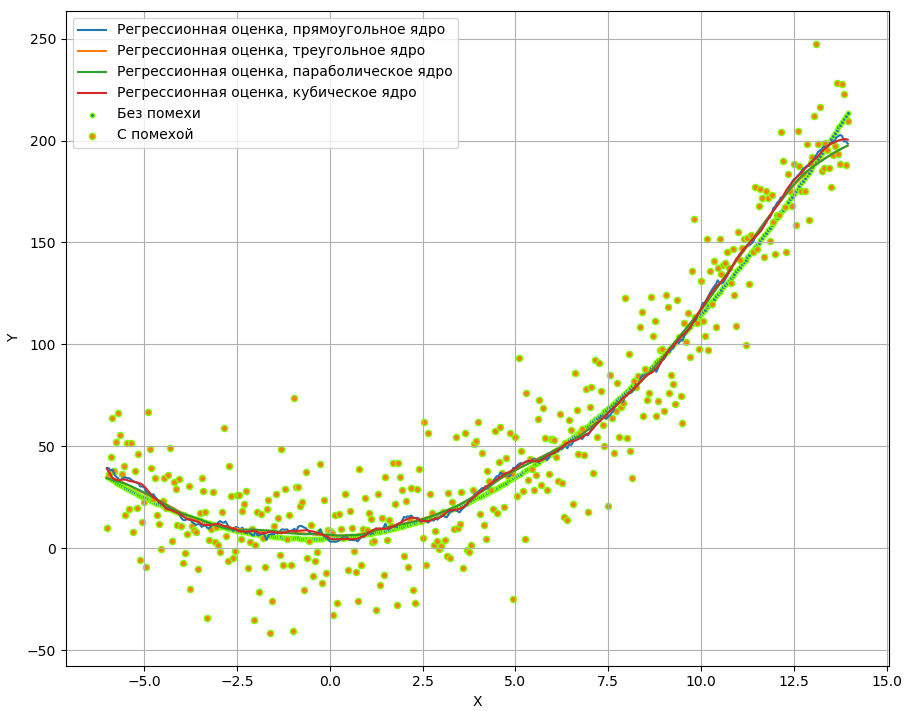
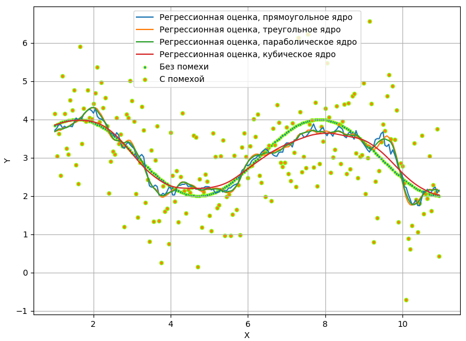
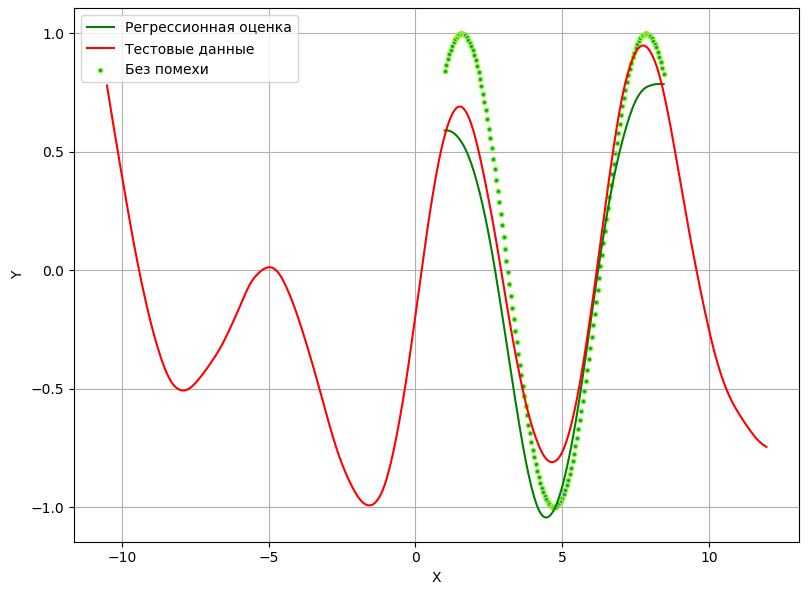

# Пример работы с непараметрикой

## Непараметрическая оценка регрессии

Приведён пример реализации непараметрической оценки регрессии с использованием ряда ядер:

* равномерное;
* треугольное;
* параболическое (Епанечниково);
* кубическое.

Расширенный список ядерных функций можно посмотреть [здесь](https://en.wikipedia.org/wiki/Kernel_(statistics)).

В приложение есть [краткая теория](./docs/info.pdf).

## Примеры

---

---

